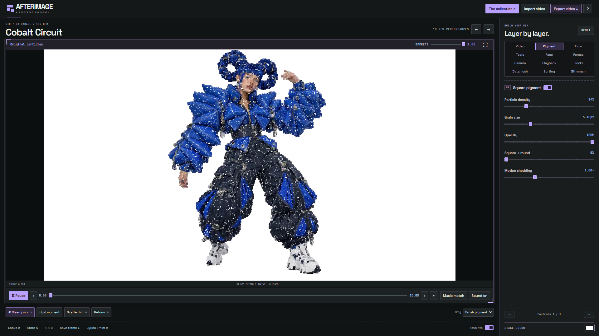

# H3 Max Particles / AFTERIMAGE

An interactive particle studio built around H3 Max dance footage. Play the original film, turn it into square pigment and optical-flow filaments, match effects to music, and briefly scatter and reform the performer.

[](https://github.com/gokayfem/H3-Max-Particles/raw/refs/heads/main/examples/afterimage-release-7mb.mp4)

**[Watch / download the release video](examples/afterimage-release-7mb.mp4)** � 15 seconds � 1080p � 24 fps � soundtrack included.

[Live studio](https://afterimage-particle-studio.fal-ai-3289.chatgpt.site/close-dance/web/studio)

## Run locally

Requires Python 3 and a current Chrome or Edge browser with WebGL 2 floating-point render targets. No API key, account, database, or npm install is needed to run the app.

```sh
python -m http.server 8770 --bind 127.0.0.1 --directory public
```

Open **http://localhost:8770**. Use HTTP rather than opening the HTML file directly. Localhost is required for browser file-storage features.

## Controls

- **Effects** reduces the actual effects. At zero, the original video stays visible.
- **Clean / mix** compares with the source while retaining the mix.
- **Face effects** controls the face region independently.
- **Music match** makes enabled effects follow the soundtrack.
- Drag over the artwork to disturb pigment; Shift-drag gives a shallow orbit.
- **Scatter hit / Reform** briefly breaks apart and restores the performer.
- **Import video / Export video** use browser-local storage and processing.

The default is the original particle look. Additional layers include tears, macroblocks, datamosh-style feedback, pixel sorting, and color bit-crushing. These are artistic image effects, not actual codec corruption.

## Project layout

```text
public/close-dance/web/       Studio source, shaders, browser import/export
public/close-dance/data/      Demo metadata, audio curves, posters, face regions
public/close-dance/cache/     Manifests referencing public numerical cache packs
public/web/vendor/           Three.js
examples/                    Finished release video and preview
scripts/                     Secret checks
tests/                      Audio, motion, settings, and cache checks
docs/                       Architecture and third-party notices
```

`public/` is the complete deployable app and canonical editable source for this repository; no unpublished parent project or generation script is needed. Serve it from any static host with HTTPS. Vendored dependencies allow it to run without a build step.

## Data and limitations

The eleven curated performances use **H3 Max video**. Demo video and numerical particle packs load from public fal CDN URLs. They are media locations, not API credentials. First playback can download hundreds of MB; the long performance is about 2 GB. These downloads are cached in browser OPFS. The demo collection needs internet access and depends on those CDN assets remaining available.

Imported videos and their derived caches stay in the browser. Imports use local tracking and flat geometry; they do not perform hosted AI depth estimation. Curated particles are a moving depth relief, not a validated dynamic 360-degree reconstruction. No H3 internal activations or latent tensors are exposed.

MP4 export uses WebCodecs when supported and falls back to WebM. Export buffers compressed output in memory, and non-1x speed changes audio pitch. Device/browser capabilities and storage affect availability. No cross-device certification is claimed.

## Checks

With Node.js 20+ and Python 3:

```sh
npm test
npm run check:secrets
```

See [security notes](SECURITY.md) and [architecture](docs/architecture.md). Code is MIT licensed; bundled third-party components retain their licenses. Demo media is separate from the code license: see [third-party and media notices](docs/third-party.md).
